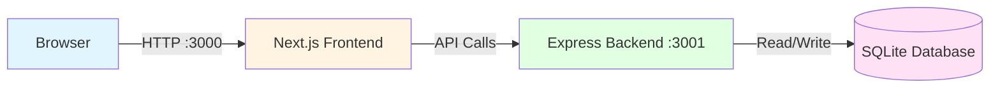

# Q-Social

A simple social micro-blogging application that allows users to post short messages (up to 280 characters) and view a feed of posts. Built with a dual-architecture approach supporting both local development and AWS serverless deployment.

## Features

- Post messages up to 280 characters
- View messages in reverse chronological order (newest first)
- Responsive design for desktop, tablet, and mobile
- Character counter with validation
- Error handling with user-friendly messages
- Dual deployment modes: local and AWS serverless

## Architecture

### Local Mode
- **Frontend:** Next.js 14+ with React 18+ and TypeScript
- **Backend:** Express.js server
- **Database:** SQLite3

### AWS Mode
- **Frontend:** Static site hosted on S3 + CloudFront
- **Backend:** AWS Lambda + API Gateway
- **Database:** DynamoDB

## Project Structure

```
q-social/
├── app/                      # Next.js App Router
│   ├── lib/                  # Frontend utilities
│   ├── globals.css
│   ├── layout.tsx
│   └── page.tsx
├── backend/
│   ├── local/                # Express server
│   │   └── server.ts
│   └── aws/                  # Lambda handlers
│       └── handlers/
│           └── messages.ts
├── shared/                   # Shared code
│   ├── types/
│   ├── config/
│   ├── validation/
│   └── utils/
├── infrastructure/           # AWS CDK
│   ├── bin/
│   └── lib/
├── scripts/
│   └── deploy-frontend.js
└── data/                     # SQLite database (local only)
```

## Prerequisites

- Node.js 20+
- npm or pnpm
- AWS CLI (for AWS deployment)
- AWS CDK CLI (for AWS deployment): `npm install -g aws-cdk`

## Local Development Setup

1. **Install dependencies:**
   ```bash
   npm install
   ```

2. **Configure environment:**
   ```bash
   cp .env.local.example .env.local
   ```

3. **Start local development:**
   ```bash
   npm run dev:local
   ```

   This starts both the backend (port 3001) and frontend (port 3000) concurrently.

4. **Access the application:**
   Open http://localhost:3000 in your browser.

### Architecture Diagram



**Port Configuration:**
- **Port 3000:** Next.js frontend server
- **Port 3001:** Express backend API server
- Frontend makes API calls to `http://localhost:3001/api/*`
- Both servers must be running simultaneously (use `npm run dev:local`)

## Remote Development with Proxy

For remote development environments, you can proxy API requests:

1. **Set proxy environment variable:**
   ```bash
   export PROXY_API_URL=https://your-remote-backend.example.com
   ```

2. **Start frontend only:**
   ```bash
   npm run dev:frontend
   ```

   API requests to `/api/*` will be proxied to the remote backend.

## AWS Deployment

### Prerequisites

- AWS CLI configured with credentials
- AWS CDK CLI installed globally
- Sufficient AWS permissions for Lambda, API Gateway, DynamoDB, S3, and CloudFront

### Deploy to AWS

1. **Build and deploy backend infrastructure:**
   ```bash
   npm run deploy:backend
   ```

   This builds the Lambda handlers and deploys the CDK stack (DynamoDB, Lambda, API Gateway, S3, CloudFront).

2. **Build and deploy frontend:**
   ```bash
   npm run deploy:frontend
   ```

   This builds the Next.js static site and uploads it to S3, then invalidates the CloudFront cache.

3. **Or deploy everything at once:**
   ```bash
   npm run deploy:aws
   ```

4. **Access your deployed application:**
   The CloudFront URL will be displayed in the deployment output.

### Tear Down AWS Resources

```bash
npm run cdk:destroy
```

## Environment Variables

### Local Development (`.env.local`)

```bash
NEXT_PUBLIC_ENV=local
NEXT_PUBLIC_API_URL=http://localhost:3001
CORS_ORIGINS=http://localhost:3000
```

### AWS Production (`.env.production.local`)

Generated automatically by the deployment script:

```bash
NEXT_PUBLIC_ENV=aws
NEXT_PUBLIC_API_URL=https://xxxxxxxxxx.execute-api.region.amazonaws.com/prod/
```

### Remote Development with Proxy

```bash
PROXY_API_URL=https://your-remote-backend.example.com
```

## API Endpoints

### POST /api/messages

Create a new message.

**Request:**
```json
{
  "content": "Hello, Q-Social!"
}
```

**Response (201 Created):**
```json
{
  "message": {
    "id": "msg_1234567890",
    "content": "Hello, Q-Social!",
    "createdAt": 1709038800000
  }
}
```

**Error Response (400 Bad Request):**
```json
{
  "error": "Message content must be between 1 and 280 characters",
  "code": "VALIDATION_ERROR"
}
```

### GET /api/messages

Retrieve all messages in reverse chronological order.

**Response (200 OK):**
```json
{
  "messages": [
    {
      "id": "msg_1234567891",
      "content": "Latest message",
      "createdAt": 1709038900000
    },
    {
      "id": "msg_1234567890",
      "content": "Hello, Q-Social!",
      "createdAt": 1709038800000
    }
  ]
}
```

## Development Scripts

- `npm run dev:local` - Start both backend and frontend for local development
- `npm run dev:backend` - Start only the Express backend server
- `npm run dev:frontend` - Start only the Next.js frontend
- `npm run build:backend` - Build Lambda handlers for AWS
- `npm run build:frontend` - Build Next.js static site
- `npm run deploy:backend` - Deploy AWS infrastructure with CDK
- `npm run deploy:frontend` - Deploy frontend to S3
- `npm run deploy:aws` - Deploy both backend and frontend to AWS
- `npm run cdk:synth` - Synthesize CloudFormation template
- `npm run cdk:destroy` - Tear down AWS resources

## Technical Details

### Message Validation

- Content must be a non-empty string
- Maximum length: 280 characters
- Content is trimmed before saving

### Database Schema

**SQLite (Local):**
```sql
CREATE TABLE messages (
  id TEXT PRIMARY KEY,
  content TEXT NOT NULL,
  created_at INTEGER NOT NULL
);
```

**DynamoDB (AWS):**
- Table: `q-social-messages`
- Partition Key: `id` (String)
- Billing Mode: Pay-per-request

### Error Codes

- `VALIDATION_ERROR` - Invalid input (e.g., empty message, too long)
- `NETWORK_ERROR` - Network connectivity issues
- `DATABASE_ERROR` - Database operation failed
- `INTERNAL_ERROR` - Unexpected server error

## Security

- Input validation on both client and server
- CORS configured for specific origins (no wildcards in production)
- Content automatically escaped by React (XSS protection)
- AWS resources use least-privilege IAM permissions

## Future Enhancements

- User authentication and authorization
- Message editing and deletion
- Pagination for large message feeds
- Real-time updates with WebSockets
- Image attachments
- User profiles
- Message reactions and replies
- Search functionality

## License

MIT
