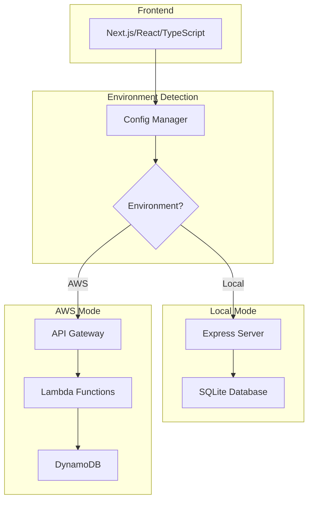
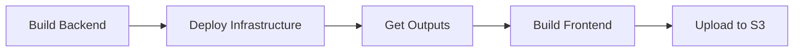

# Q-Social Technical Design Document

## 1. Architecture Overview

Q-Social is built with a dual-architecture approach supporting both local development and AWS serverless deployment. The application uses a unified codebase with environment-specific adapters.



## 2. Technology Stack

### Frontend
- **Framework:** Next.js 14+ (App Router)
- **Language:** TypeScript 5+
- **UI Library:** React 18+
- **Styling:** CSS Modules / Tailwind CSS
- **HTTP Client:** Fetch API with custom wrapper

### Backend - Local Mode
- **Runtime:** Node.js 20+
- **Framework:** Express.js
- **Database:** SQLite3
- **ORM:** None (direct SQL queries)

### Backend - AWS Mode
- **Compute:** AWS Lambda (Node.js 20 runtime)
- **API:** API Gateway (REST API)
- **Database:** DynamoDB
- **Infrastructure:** AWS CDK (TypeScript)

### Development Tools
- **Package Manager:** npm/pnpm
- **Build Tool:** Next.js built-in + esbuild
- **TypeScript Runner:** tsx (for local development)
- **Linting:** ESLint
- **Type Checking:** TypeScript compiler

## 2.1 Project Structure

```
q-social/
├── app/                      # Next.js App Router
│   ├── lib/                  # Frontend utilities
│   │   ├── api-client.ts
│   │   └── error-handler.ts
│   ├── globals.css
│   └── page.tsx
├── backend/
│   ├── local/
│   │   └── server.ts
│   └── aws/
│       └── handlers/
│           └── messages.ts
├── shared/                   # Shared code between frontend/backend
│   ├── types/
│   │   ├── message.ts
│   │   └── index.ts
│   ├── config/
│   │   └── environment.ts
│   ├── validation/
│   │   └── message.ts
│   └── utils/
│       └── logger.ts
├── infrastructure/           # AWS CDK
│   ├── bin/
│   │   └── app.ts
│   ├── lib/
│   │   └── q-social-stack.ts
│   └── cdk.json
├── scripts/
│   └── deploy-frontend.js
├── data/                     # SQLite database (local only)
├── next.config.js
├── tsconfig.json
└── package.json
```

## 3. Data Model

### TypeScript Interfaces

```typescript
// shared/types/message.ts
export interface Message {
  id: string;
  content: string;
  createdAt: number; // Unix timestamp
}

export interface CreateMessageRequest {
  content: string;
}

export interface CreateMessageResponse {
  message: Message;
}

export interface GetMessagesResponse {
  messages: Message[];
}

export interface ErrorResponse {
  error: string;
  code: string;
}
```

### Database Schema

**SQLite (Local):**
```sql
CREATE TABLE messages (
  id TEXT PRIMARY KEY,
  content TEXT NOT NULL,
  created_at INTEGER NOT NULL
);

CREATE INDEX idx_messages_created_at ON messages(created_at DESC);
```

**DynamoDB (AWS):**
```typescript
// Table: q-social-messages
// Simple table with partition key only
// Uses Scan operation to retrieve all messages (acceptable for small datasets)
{
  TableName: 'q-social-messages',
  KeySchema: [
    { AttributeName: 'id', KeyType: 'HASH' }
  ],
  AttributeDefinitions: [
    { AttributeName: 'id', AttributeType: 'S' }
  ]
}

// Note: For production with large datasets, consider:
// - Adding pagination
// - Using a fixed partition key with createdAt as sort key
// - Implementing time-based partitioning
```

## 4. API Design

### REST Endpoints

```
POST   /api/messages      Create a new message
GET    /api/messages      Retrieve all messages (newest first)
```

### Request/Response Examples

**POST /api/messages**
```json
// Request
{
  "content": "Hello, Q-Social!"
}

// Response (201 Created)
{
  "message": {
    "id": "msg_1234567890",
    "content": "Hello, Q-Social!",
    "createdAt": 1709038800000
  }
}

// Error Response (400 Bad Request)
{
  "error": "Message content must be between 1 and 280 characters",
  "code": "VALIDATION_ERROR"
}
```

**GET /api/messages**
```json
// Response (200 OK)
{
  "messages": [
    {
      "id": "msg_1234567891",
      "content": "Latest message",
      "createdAt": 1709038900000
    },
    {
      "id": "msg_1234567890",
      "content": "Hello, Q-Social!",
      "createdAt": 1709038800000
    }
  ]
}
```

## 5. Configuration Management

### Environment Detection

```typescript
// shared/config/environment.ts
export type Environment = 'local' | 'aws';

export interface Config {
  environment: Environment;
  apiBaseUrl: string;
  corsOrigins: string[];
}

export function getConfig(): Config {
  const env = process.env.NEXT_PUBLIC_ENV || 'local';
  
  if (env === 'aws') {
    return {
      environment: 'aws',
      apiBaseUrl: process.env.NEXT_PUBLIC_API_URL || '',
      corsOrigins: [process.env.NEXT_PUBLIC_APP_URL || '']
    };
  }
  
  return {
    environment: 'local',
    apiBaseUrl: process.env.NEXT_PUBLIC_API_URL || 'http://localhost:3001',
    corsOrigins: ['http://localhost:3000']
  };
}
```

### Proxy Support for Remote Development

```typescript
// next.config.js
module.exports = {
  output: 'export',
  images: {
    unoptimized: true
  },
  async rewrites() {
    // Support remote development with proxy (only in dev mode)
    if (process.env.NODE_ENV === 'development' && process.env.PROXY_API_URL) {
      return [
        {
          source: '/api/:path*',
          destination: `${process.env.PROXY_API_URL}/api/:path*`
        }
      ];
    }
    return [];
  }
};
```

### Environment Variables

```bash
# .env.local (Local Development)
NEXT_PUBLIC_ENV=local
NEXT_PUBLIC_API_URL=http://localhost:3001
CORS_ORIGINS=http://localhost:3000

# .env.local (Remote Development with Proxy)
NEXT_PUBLIC_ENV=local
PROXY_API_URL=https://remote-dev-server.example.com

# .env.production.local (AWS Deployment - generated by deploy script)
NEXT_PUBLIC_ENV=aws
NEXT_PUBLIC_API_URL=https://xxxxxxxxxx.execute-api.region.amazonaws.com/prod/
```

## 6. Backend Implementation

### Local Mode - Express Server

```typescript
// backend/local/server.ts
import express from 'express';
import cors from 'cors';
import { Database } from 'sqlite3';
import { v4 as uuidv4 } from 'uuid';
import { validateMessageContent } from '../../shared/validation/message';
import { logError } from '../../shared/utils/logger';

const app = express();
const db = new Database('./data/messages.db');

// Initialize database
db.run(`
  CREATE TABLE IF NOT EXISTS messages (
    id TEXT PRIMARY KEY,
    content TEXT NOT NULL,
    created_at INTEGER NOT NULL
  )
`);

db.run(`
  CREATE INDEX IF NOT EXISTS idx_messages_created_at 
  ON messages(created_at DESC)
`);

// CORS configuration
const corsOrigins = process.env.CORS_ORIGINS 
  ? process.env.CORS_ORIGINS.split(',') 
  : ['http://localhost:3000'];

app.use(cors({ origin: corsOrigins }));
app.use(express.json());

// POST /api/messages
app.post('/api/messages', async (req, res) => {
  try {
    const { content } = req.body;
    
    const validation = validateMessageContent(content);
    if (!validation.valid) {
      return res.status(400).json({
        error: validation.error,
        code: 'VALIDATION_ERROR'
      });
    }
    
    const message = {
      id: uuidv4(),
      content: content.trim(),
      createdAt: Date.now()
    };
    
    db.run(
      'INSERT INTO messages (id, content, created_at) VALUES (?, ?, ?)',
      [message.id, message.content, message.createdAt],
      (err) => {
        if (err) {
          logError('Database insert error', err);
          return res.status(500).json({
            error: 'Failed to create message',
            code: 'DATABASE_ERROR'
          });
        }
        
        res.status(201).json({ message });
      }
    );
  } catch (error) {
    logError('Server error in POST /api/messages', error);
    res.status(500).json({
      error: 'Internal server error',
      code: 'INTERNAL_ERROR'
    });
  }
});

// GET /api/messages
app.get('/api/messages', async (req, res) => {
  try {
    db.all(
      'SELECT id, content, created_at as createdAt FROM messages ORDER BY created_at DESC',
      [],
      (err, rows) => {
        if (err) {
          logError('Database query error', err);
          return res.status(500).json({
            error: 'Failed to retrieve messages',
            code: 'DATABASE_ERROR'
          });
        }
        
        res.json({ messages: rows });
      }
    );
  } catch (error) {
    logError('Server error in GET /api/messages', error);
    res.status(500).json({
      error: 'Internal server error',
      code: 'INTERNAL_ERROR'
    });
  }
});

const PORT = process.env.PORT || 3001;
app.listen(PORT, () => {
  console.log(`Local server running on http://localhost:${PORT}`);
});
```

### AWS Mode - Lambda Functions

```typescript
// backend/aws/handlers/messages.ts
import { APIGatewayProxyEvent, APIGatewayProxyResult } from 'aws-lambda';
import { DynamoDBClient } from '@aws-sdk/client-dynamodb';
import { DynamoDBDocumentClient, PutCommand, ScanCommand } from '@aws-sdk/lib-dynamodb';
import { v4 as uuidv4 } from 'uuid';
import { validateMessageContent } from '../../../shared/validation/message';
import { logError } from '../../../shared/utils/logger';

const client = new DynamoDBClient({});
const docClient = DynamoDBDocumentClient.from(client);
const TABLE_NAME = process.env.TABLE_NAME || 'q-social-messages';
const CORS_ORIGIN = process.env.CORS_ORIGIN || '*';

const headers = {
  'Content-Type': 'application/json',
  'Access-Control-Allow-Origin': CORS_ORIGIN,
  'Access-Control-Allow-Methods': 'GET, POST, OPTIONS',
  'Access-Control-Allow-Headers': 'Content-Type'
};

export async function createMessage(
  event: APIGatewayProxyEvent
): Promise<APIGatewayProxyResult> {
  try {
    if (!event.body) {
      return {
        statusCode: 400,
        headers,
        body: JSON.stringify({
          error: 'Request body is required',
          code: 'VALIDATION_ERROR'
        })
      };
    }
    
    const { content } = JSON.parse(event.body);
    
    const validation = validateMessageContent(content);
    if (!validation.valid) {
      return {
        statusCode: 400,
        headers,
        body: JSON.stringify({
          error: validation.error,
          code: 'VALIDATION_ERROR'
        })
      };
    }
    
    const message = {
      id: uuidv4(),
      content: content.trim(),
      createdAt: Date.now()
    };
    
    await docClient.send(new PutCommand({
      TableName: TABLE_NAME,
      Item: message
    }));
    
    return {
      statusCode: 201,
      headers,
      body: JSON.stringify({ message })
    };
  } catch (error) {
    logError('Error creating message', error);
    return {
      statusCode: 500,
      headers,
      body: JSON.stringify({
        error: 'Internal server error',
        code: 'INTERNAL_ERROR'
      })
    };
  }
}

export async function getMessages(
  event: APIGatewayProxyEvent
): Promise<APIGatewayProxyResult> {
  try {
    const result = await docClient.send(new ScanCommand({
      TableName: TABLE_NAME
    }));
    
    const messages = (result.Items || []).sort((a, b) => b.createdAt - a.createdAt);
    
    return {
      statusCode: 200,
      headers,
      body: JSON.stringify({ messages })
    };
  } catch (error) {
    logError('Error retrieving messages', error);
    return {
      statusCode: 500,
      headers,
      body: JSON.stringify({
        error: 'Internal server error',
        code: 'INTERNAL_ERROR'
      })
    };
  }
}
```

## 7. Frontend Implementation

### API Client

```typescript
// app/lib/api-client.ts
import type {
  Message,
  CreateMessageRequest,
  CreateMessageResponse,
  GetMessagesResponse,
  ErrorResponse
} from '../../shared/types/message';

class ApiError extends Error {
  constructor(
    public statusCode: number,
    public code: string,
    message: string
  ) {
    super(message);
    this.name = 'ApiError';
  }
}

async function fetchApi<T>(
  endpoint: string,
  options?: RequestInit
): Promise<T> {
  const apiBaseUrl = process.env.NEXT_PUBLIC_API_URL || 'http://localhost:3001';
  const url = `${apiBaseUrl}${endpoint}`;
  
  try {
    const response = await fetch(url, {
      ...options,
      headers: {
        'Content-Type': 'application/json',
        ...options?.headers
      }
    });
    
    const data = await response.json();
    
    if (!response.ok) {
      const error = data as ErrorResponse;
      throw new ApiError(response.status, error.code, error.error);
    }
    
    return data as T;
  } catch (error) {
    if (error instanceof ApiError) {
      throw error;
    }
    throw new ApiError(0, 'NETWORK_ERROR', 'Network request failed');
  }
}

export async function createMessage(content: string): Promise<Message> {
  const response = await fetchApi<CreateMessageResponse>('/api/messages', {
    method: 'POST',
    body: JSON.stringify({ content } as CreateMessageRequest)
  });
  return response.message;
}

export async function getMessages(): Promise<Message[]> {
  const response = await fetchApi<GetMessagesResponse>('/api/messages');
  return response.messages;
}

export { ApiError };
```

### Main Page Component

```typescript
// app/page.tsx
'use client';

import { useState, useEffect } from 'react';
import { createMessage, getMessages, ApiError } from './lib/api-client';
import type { Message } from '../shared/types/message';

export default function Home() {
  const [messages, setMessages] = useState<Message[]>([]);
  const [content, setContent] = useState('');
  const [error, setError] = useState<string | null>(null);
  const [loading, setLoading] = useState(false);

  useEffect(() => {
    loadMessages();
  }, []);

  async function loadMessages() {
    try {
      const data = await getMessages();
      setMessages(data);
      setError(null);
    } catch (err) {
      if (err instanceof ApiError) {
        setError(err.message);
      } else {
        setError('Failed to load messages');
      }
    }
  }

  async function handleSubmit(e: React.FormEvent) {
    e.preventDefault();
    setLoading(true);
    setError(null);

    try {
      const newMessage = await createMessage(content);
      setMessages([newMessage, ...messages]);
      setContent('');
    } catch (err) {
      if (err instanceof ApiError) {
        setError(err.message);
      } else {
        setError('Failed to post message');
      }
    } finally {
      setLoading(false);
    }
  }

  const remainingChars = 280 - content.length;

  return (
    <main className="container">
      <h1>Q-Social</h1>
      
      <form onSubmit={handleSubmit}>
        <textarea
          value={content}
          onChange={(e) => setContent(e.target.value)}
          placeholder="What's happening?"
          maxLength={280}
          disabled={loading}
        />
        <div className="form-footer">
          <span className={remainingChars < 0 ? 'error' : ''}>
            {remainingChars} characters remaining
          </span>
          <button type="submit" disabled={loading || !content.trim()}>
            Post
          </button>
        </div>
      </form>

      {error && <div className="error-message">{error}</div>}

      <div className="feed">
        {messages.map((message) => (
          <div key={message.id} className="message">
            <p>{message.content}</p>
            <time>{new Date(message.createdAt).toLocaleString()}</time>
          </div>
        ))}
      </div>
    </main>
  );
}
```

## 8. Infrastructure as Code (AWS CDK)

```typescript
// infrastructure/lib/q-social-stack.ts
import * as cdk from 'aws-cdk-lib';
import * as lambda from 'aws-cdk-lib/aws-lambda';
import * as apigateway from 'aws-cdk-lib/aws-apigateway';
import * as dynamodb from 'aws-cdk-lib/aws-dynamodb';
import * as s3 from 'aws-cdk-lib/aws-s3';
import * as s3deploy from 'aws-cdk-lib/aws-s3-deployment';
import * as cloudfront from 'aws-cdk-lib/aws-cloudfront';
import * as origins from 'aws-cdk-lib/aws-cloudfront-origins';
import { Construct } from 'constructs';

export class QSocialStack extends cdk.Stack {
  constructor(scope: Construct, id: string, props?: cdk.StackProps) {
    super(scope, id, props);

    // DynamoDB Table
    const messagesTable = new dynamodb.Table(this, 'MessagesTable', {
      tableName: 'q-social-messages',
      partitionKey: { name: 'id', type: dynamodb.AttributeType.STRING },
      billingMode: dynamodb.BillingMode.PAY_PER_REQUEST,
      removalPolicy: cdk.RemovalPolicy.DESTROY
    });

    // S3 Bucket for Frontend
    const websiteBucket = new s3.Bucket(this, 'WebsiteBucket', {
      websiteIndexDocument: 'index.html',
      publicReadAccess: true,
      removalPolicy: cdk.RemovalPolicy.DESTROY,
      autoDeleteObjects: true
    });

    // CloudFront Distribution
    const distribution = new cloudfront.Distribution(this, 'Distribution', {
      defaultBehavior: {
        origin: new origins.S3Origin(websiteBucket),
        viewerProtocolPolicy: cloudfront.ViewerProtocolPolicy.REDIRECT_TO_HTTPS
      },
      defaultRootObject: 'index.html'
    });

    // Lambda Functions
    const createMessageFn = new lambda.Function(this, 'CreateMessageFunction', {
      runtime: lambda.Runtime.NODEJS_20_X,
      handler: 'messages.createMessage',
      code: lambda.Code.fromAsset('../backend/aws/dist'),
      environment: {
        TABLE_NAME: messagesTable.tableName,
        CORS_ORIGIN: `https://${distribution.distributionDomainName}`
      }
    });

    const getMessagesFn = new lambda.Function(this, 'GetMessagesFunction', {
      runtime: lambda.Runtime.NODEJS_20_X,
      handler: 'messages.getMessages',
      code: lambda.Code.fromAsset('../backend/aws/dist'),
      environment: {
        TABLE_NAME: messagesTable.tableName,
        CORS_ORIGIN: `https://${distribution.distributionDomainName}`
      }
    });

    messagesTable.grantWriteData(createMessageFn);
    messagesTable.grantReadData(getMessagesFn);

    // API Gateway
    const api = new apigateway.RestApi(this, 'QSocialApi', {
      restApiName: 'Q-Social API',
      defaultCorsPreflightOptions: {
        allowOrigins: [`https://${distribution.distributionDomainName}`],
        allowMethods: apigateway.Cors.ALL_METHODS
      }
    });

    const messages = api.root.addResource('api').addResource('messages');
    messages.addMethod('POST', new apigateway.LambdaIntegration(createMessageFn));
    messages.addMethod('GET', new apigateway.LambdaIntegration(getMessagesFn));

    // Outputs
    new cdk.CfnOutput(this, 'ApiUrl', {
      value: api.url,
      description: 'API Gateway URL'
    });

    new cdk.CfnOutput(this, 'DistributionUrl', {
      value: `https://${distribution.distributionDomainName}`,
      description: 'CloudFront Distribution URL'
    });

    new cdk.CfnOutput(this, 'BucketName', {
      value: websiteBucket.bucketName,
      description: 'S3 Bucket Name for Frontend'
    });
  }
}
```

## 9. Deployment Process

### Two-Phase Deployment



### Deployment Scripts

```json
// package.json
{
  "scripts": {
    "dev:local": "concurrently \"npm run dev:backend\" \"npm run dev:frontend\"",
    "dev:backend": "tsx backend/local/server.ts",
    "dev:frontend": "next dev",
    
    "build:backend": "esbuild backend/aws/handlers/*.ts --bundle --platform=node --target=node20 --outdir=backend/aws/dist",
    "build:frontend": "next build",
    
    "deploy:backend": "npm run build:backend && cd infrastructure && cdk deploy --outputs-file ../cdk-outputs.json",
    "deploy:frontend": "node scripts/deploy-frontend.js",
    "deploy:aws": "npm run deploy:backend && npm run deploy:frontend",
    
    "cdk:synth": "cd infrastructure && cdk synth",
    "cdk:destroy": "cd infrastructure && cdk destroy"
  }
}
```

```javascript
// scripts/deploy-frontend.js
const fs = require('fs');
const { execSync } = require('child_process');

// Read CDK outputs
const outputs = JSON.parse(fs.readFileSync('cdk-outputs.json', 'utf8'));
const stackOutputs = outputs.QSocialStack;
const apiUrl = stackOutputs.ApiUrl;
const distributionUrl = stackOutputs.DistributionUrl;
const bucketName = stackOutputs.BucketName;

// Create production environment file
const envContent = `NEXT_PUBLIC_ENV=aws
NEXT_PUBLIC_API_URL=${apiUrl}
`;

fs.writeFileSync('.env.production.local', envContent);

// Build frontend with production config
console.log('Building frontend...');
execSync('npm run build:frontend', { stdio: 'inherit' });

// Upload to S3
console.log('Uploading to S3...');
execSync(`aws s3 sync out/ s3://${bucketName}/ --delete`, { stdio: 'inherit' });

// Invalidate CloudFront cache
const distributionId = distributionUrl.split('//')[1].split('.')[0];
console.log('Invalidating CloudFront cache...');
execSync(`aws cloudfront create-invalidation --distribution-id ${distributionId} --paths "/*"`, { stdio: 'inherit' });

console.log('\nDeployment complete!');
console.log(`API URL: ${apiUrl}`);
console.log(`App URL: ${distributionUrl}`);
```

## 10. Error Handling Patterns

### Frontend Error Handling

```typescript
// app/lib/error-handler.ts
import { ApiError } from './api-client';

export function getErrorMessage(error: unknown): string {
  if (error instanceof ApiError) {
    switch (error.code) {
      case 'VALIDATION_ERROR':
        return error.message;
      case 'NETWORK_ERROR':
        return 'Unable to connect. Please check your internet connection.';
      case 'DATABASE_ERROR':
      case 'INTERNAL_ERROR':
        return 'Something went wrong. Please try again later.';
      default:
        return 'An unexpected error occurred.';
    }
  }
  return 'An unexpected error occurred.';
}
```

### Backend Error Logging

```typescript
// shared/utils/logger.ts
export function logError(context: string, error: unknown) {
  const timestamp = new Date().toISOString();
  const errorMessage = error instanceof Error ? error.message : String(error);
  const stack = error instanceof Error ? error.stack : '';
  
  console.error(JSON.stringify({
    timestamp,
    context,
    error: errorMessage,
    stack
  }));
}
```

## 11. Security Measures

### Input Validation

```typescript
// shared/validation/message.ts
export interface ValidationResult {
  valid: boolean;
  error?: string;
}

export function validateMessageContent(content: unknown): ValidationResult {
  if (typeof content !== 'string') {
    return { valid: false, error: 'Message content must be a string' };
  }
  
  const trimmed = content.trim();
  
  if (trimmed.length === 0) {
    return { valid: false, error: 'Message content cannot be empty' };
  }
  
  if (trimmed.length > 280) {
    return { valid: false, error: 'Message content must be 280 characters or less' };
  }
  
  return { valid: true };
}
```

### Content Sanitization

```typescript
// shared/utils/sanitize.ts
// Note: This is optional. Content is stored as plain text and should be
// escaped when rendered in the UI. Next.js/React automatically escapes
// text content, preventing XSS attacks.

export function sanitizeContent(content: string): string {
  return content.trim().substring(0, 280);
}
```

### CORS Configuration

- Local: Allow `http://localhost:3000`
- AWS: Allow specific CloudFront distribution domain
- Never use `*` in production

### Environment Variable Security

- Never commit `.env` files
- Use AWS Secrets Manager for sensitive data in production
- Validate all environment variables at startup

## 12. Testing Strategy

### Unit Tests

```typescript
// __tests__/validation.test.ts
import { validateMessageContent } from '../shared/validation/message';

describe('validateMessageContent', () => {
  it('accepts valid content', () => {
    const result = validateMessageContent('Hello, world!');
    expect(result.valid).toBe(true);
  });

  it('rejects empty content', () => {
    const result = validateMessageContent('   ');
    expect(result.valid).toBe(false);
    expect(result.error).toContain('empty');
  });

  it('rejects content over 280 characters', () => {
    const result = validateMessageContent('a'.repeat(281));
    expect(result.valid).toBe(false);
    expect(result.error).toContain('280');
  });
});
```

### Integration Tests

```typescript
// __tests__/api.test.ts
import { createMessage, getMessages } from '../frontend/lib/api-client';

describe('API Integration', () => {
  it('creates and retrieves messages', async () => {
    const content = 'Test message';
    const message = await createMessage(content);
    
    expect(message.content).toBe(content);
    expect(message.id).toBeDefined();
    
    const messages = await getMessages();
    expect(messages).toContainEqual(message);
  });
});
```

## 13. Development Workflow

### Local Development

```bash
# Start local development
npm run dev:local

# Frontend: http://localhost:3000
# Backend: http://localhost:3001
```

### Remote Development

```bash
# Set proxy for remote backend
export PROXY_API_URL=https://remote-dev.example.com

# Start frontend only
npm run dev:frontend
```

### AWS Deployment

```bash
# Deploy backend and frontend
npm run deploy:aws

# Deploy backend only
npm run deploy:backend

# Deploy frontend only (after backend)
npm run deploy:frontend
```

## 14. Monitoring and Observability

### CloudWatch Logs (AWS)
- Lambda function logs automatically sent to CloudWatch
- API Gateway access logs enabled
- Custom metrics for message creation rate

### Local Logging
- Console logs with structured JSON format
- Error logs include stack traces
- Request/response logging in development mode

## 15. Future Enhancements

- User authentication and authorization
- Message editing and deletion
- Pagination for large message feeds
- Real-time updates with WebSockets
- Image attachments
- User profiles
- Message reactions and replies
- Search functionality
- Rate limiting
- Caching layer (Redis/ElastiCache)
