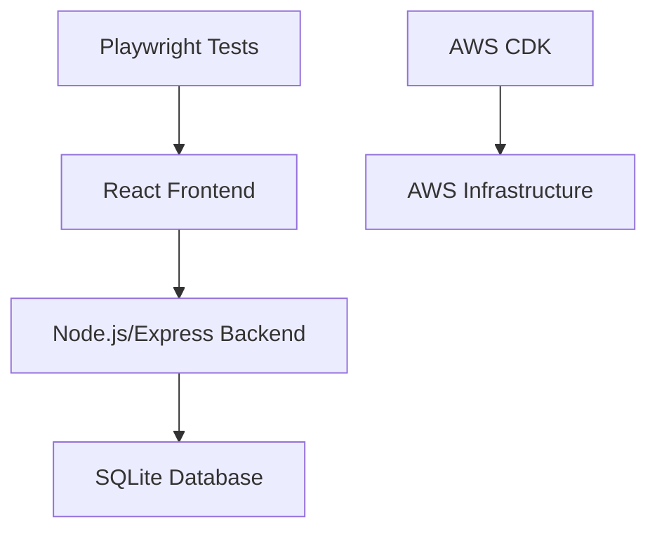

# Design Document

## Overview

Q-Social will be built as a simple full-stack web application using TypeScript for both frontend and backend. The architecture emphasizes simplicity and educational value, making it perfect for a 2-hour workshop that demonstrates spec-driven development principles.

## Architecture

### System Architecture


### Technology Stack

**Single Language Approach: TypeScript**
- **Frontend**: React with TypeScript and Vite
- **Backend**: Node.js with Express and TypeScript
- **Database**: SQLite (simple file-based database)
- **Testing**: Playwright for end-to-end testing
- **Infrastructure**: AWS CDK with TypeScript

This single-language approach reduces cognitive load and allows students to focus on the spec-driven development process rather than context switching between languages.

## Components and Interfaces

### Frontend Components

#### App Component
```typescript
interface Message {
  id: string;
  content: string;
  timestamp: string;
}

function App() {
  // Manages messages state and API calls
  // Renders MessageForm and MessageFeed
}
```

#### MessageForm Component
```typescript
interface MessageFormProps {
  onMessagePosted: (message: Message) => void;
}

function MessageForm({ onMessagePosted }: MessageFormProps) {
  // Handles input state and form submission
  // Basic validation for empty messages
}
```

#### MessageFeed Component
```typescript
interface MessageFeedProps {
  messages: Message[];
}

function MessageFeed({ messages }: MessageFeedProps) {
  // Displays list of messages
  // Shows "No messages yet" when empty
}
```

### Backend API Endpoints

#### POST /api/messages
- Request: `{ content: string }`
- Response: `{ id: string, content: string, timestamp: string }`
- Validation: Non-empty content, max 280 characters

#### GET /api/messages
- Response: `{ messages: Message[] }`
- Returns messages ordered by newest first

## Data Models

### Database Schema
```sql
CREATE TABLE messages (
    id TEXT PRIMARY KEY,
    content TEXT NOT NULL,
    timestamp DATETIME DEFAULT CURRENT_TIMESTAMP
);
```

### TypeScript Interfaces
```typescript
// Shared between frontend and backend
interface Message {
  id: string;
  content: string;
  timestamp: string;
}

interface CreateMessageRequest {
  content: string;
}

interface GetMessagesResponse {
  messages: Message[];
}
```

## Error Handling

### Frontend
- Display error messages for failed API calls
- Prevent submission of empty messages
- Show loading states during API requests

### Backend
- Return appropriate HTTP status codes
- Validate request data
- Handle database errors gracefully

## Testing Strategy

### Playwright End-to-End Tests
- Test posting a message and seeing it appear in the feed
- Test empty message validation
- Test basic UI interactions
- Test API error handling

## AWS Infrastructure Design

### Simple CDK Stack
```typescript
// Single stack for simplicity
class QSocialStack extends Stack {
  // S3 bucket for frontend hosting
  // Lambda function for backend API
  // API Gateway for HTTP routing
  // Basic CloudWatch logging
}
```

### Components
- **S3**: Static website hosting for React app
- **Lambda**: Serverless backend running Express app
- **API Gateway**: HTTP API routing to Lambda
- **CloudWatch**: Basic logging and monitoring

This simplified infrastructure focuses on core AWS concepts without overwhelming complexity, perfect for a workshop setting.